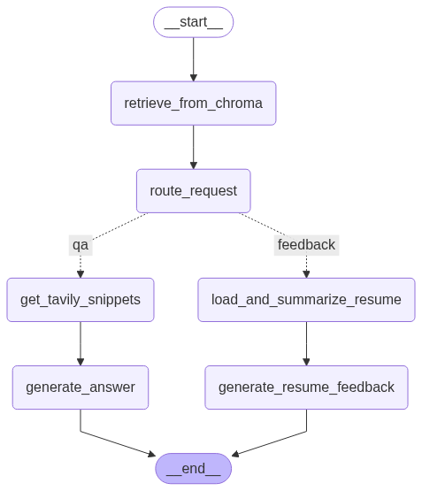

# LLM 기반 AI 에이전트 서비스

<p align="center">
    
</p>

다양한 LLM(거대 언어 모델) 기반 기능을 제공하는 AI 에이전트 서비스입니다. 사용자의 질문에 답변하고, 뉴스 기사를 요약하며, 파일 기반의 질의응답을 수행할 수 있습니다.

---

### 🛠️ 기술 스택

<p>
  
  
  
  
  
  
</p>

---

## 1. 시스템 아키텍처

본 서비스는 Docker Compose를 통해 여러 컨테이너를 오케스트레이션하는 MSA(마이크로서비스 아키텍처)로 설계되었습니다.

- **`llm-service`**: FastAPI로 구현된 메인 애플리케케이션으로, 핵심 비즈니스 로직과 API 엔드포인트를 제공합니다.
- **`ollama`**: 로컬 환경에서 언어 모델을 실행하고 관리하는 서비스입니다.
- **`chroma`**: 벡터 데이터베이스로, 텍스트 임베딩을 저장하고 검색하여 RAG(Retrieval-Augmented Generation) 파이프라인을 지원합니다.

---

## 2. 🚀 시작하기

### 2.1. 사전 요구사항

- Docker & Docker Compose
- Python 3.12+
- Poetry

### 2.2. 로컬 개발 환경 설정

1.  **저장소 복제**

    ```bash
    git clone https://github.com/your-repository/llm-svc.git
    cd llm-svc
    ```

2.  **Python 의존성 설치**

    ```bash
    poetry install
    ```

3.  **환경 변수 설정**
    프로젝트 루트 디렉터리에 `.env` 파일을 생성하고 아래와 같이 환경 변수를 설정합니다.

    ```env
    # Ollama 서비스 주소
    OLLAMA_BASE_URL=http://localhost:11434

    # 외부 API 키
    GOOGLE_API_KEY=your-google-api-key
    TAVILY_API_KEY=your-tavily-api-key

    # ChromaDB 연결 정보
    VECTOR_DB_HOST=localhost
    VECTOR_DB_PORT=8001

    # 뉴스 원문을 가져올 Spring 서버 주소
    SPRING_SERVER_URL=http://your-spring-app:8080
    ```

4.  **서비스 실행**
    ```bash
    docker-compose up -d
    ```
    이제 `http://localhost:8000`에서 서비스에 접속할 수 있습니다.

---

## 3. 🐳 Docker를 이용한 빌드 및 실행

`llm-service`를 독립적으로 빌드하고 실행할 수도 있습니다.

1.  **Docker 이미지 빌드**

    ```bash
    docker build -t llm-service:latest -f llm-service.Dockerfile .
    ```

2.  **Docker 컨테이너 실행**
    ```bash
    docker run -p 8000:8000 --env-file .env llm-service:latest
    ```

---

## 4. 📡 API 엔드포인트

`llm-service`는 다음과 같은 주요 API 엔드포인트를 제공합니다. API에 대한 상세한 명세는 서비스 실행 후 `http://localhost:8000/docs`에서 확인할 수 있습니다.

- **`POST /chat`**: 파일 및 뉴스 기사와 관련된 질의응답을 처리합니다.
- **`POST /summarize`**: 주어진 뉴스 기사를 요약합니다.

---
